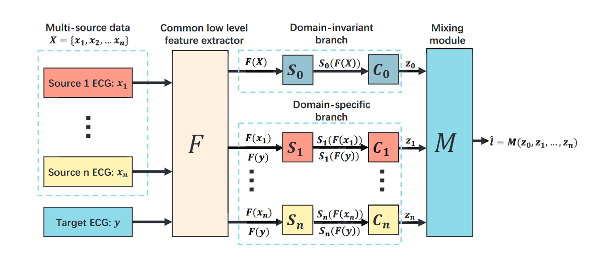

# Multi-source unsupervised domain adaptation for ECG classification

It is challenging to build a machine learning model for   automatic   arrhythmia   diagnosis   from   Electrocardiograph(ECG)  signals,  because  the  variation  in  ECG  signals  is  big between different patients or over time, and the available training datasets usually contain limited, unbalanced number of data for multiple  disease  types.  Most  existing  methods  relied  on  labeled data  from  a  single  dataset,  and  the  performance  is  poor  when generalizing  to  unseen  heart  disease  types,  limited  labels,  or distribution  shifts.  In  this  paper,  we  propose  a  multi-source unsupervised domain adaption (MUDA) neural network for ECG classification, to make effective use of data of multiple sources and improve the model’s generalization ability. Our model is featured by   a   two-branch   domain   adaption   and   a   sample-imbalance aware  mixing  strategy  to  fuse  the  information  across  domains. Specifically,  one  branch  is  devised  to  learn  domain-invariant representation,   while   the   other   is   to   extract   domain-specific features. The two branches align the ECG in the target domain to individual source domain in an exclusive and complementary manner, leading to enhanced discriminative features for domain-invariant/specific classifiers. The final prediction, which is a linear combination of the domain classification decisions, is very robust and accurate, by making use of the prior distribution of sample size across domains to place confidence scores over each classifier. Experiments on five ECG datasets indicate superior performance of  our  method  over  the  existing  ones.



## Requirements

* python 3.7 or higher
* Pytorch >= 1.8.1
* numpy >= 1.20.2
* pandas >= 1.2.3
* tensorboard >= 2.4.1
* ...

## Data preparing

We used five datasets, CPSC,CPSC_E,Georgia,PTB-XL and Hefei dataset. CPSC,CPSC_E,Georgia and PTB-XL dataset could be found on [PhysioNet](https://physionetchallenges.org/2020/). The Hefei dataset can not be download now due to the closed [competition](https://tianchi.aliyun.com/competition/entrance/231754/introduction).
Please put these datasets in the 'datasets' folder.
In our code, PTB-XL_10k means  a subset of PTB-XL which only contains 10k samples. We  used  the following selection strategy: 1) remove 90% samples only with the label of NSR; 2) randomly select 10,000 samples from the remaining datasets.

## Training

For  abbreviation,  we  use  C  denotes  CPSC  dataset,  CE  for CPSC-Extra,  P  for  PTB-XL,and G for Georgia dataset.
We provide four shell script for quick start. For example, if you want train a model transfered from C,CE,P to G,
you can just type

 ```shell 
./C_CE_P_TO_G.sh
 
 ```

Some of the available arguments are:

| Argument      | Description                         | Default         | Type    |
| ------------- | ----------------------------------- | --------------- | ------- |
| batchsize     | input batch size for model training | 64              | int     |
| steps         | number of steps to train            | 15000           | int     |
| source1_dir   | path for data source 1              | ./datasets/CPSC | str     |
| source2_dir   | path for data source 2              | ./datasets/CPSC | str     |
| source3_dir   | path for data source 3              | ./datasets/CPSC | str     |
| target_dir    | path for target dataset             | ./datasets/CPSC | str     |
| log_dir       | path for log and saved model        | ./log/          | str     |
| lr            | learning rate                       | 3e-4            | float   |
| cuda          | use cuda device for model training  | true            | boolean |
| test_interval | interval for model test             | 50              | int     |
| norm          | use normalization                   | true            | boolean |
## Pretrained model
 We also provide pretrained model,you can download it by the following links:

 * google drive:https://drive.google.com/folderview?id=15SvIdxaXJ53iG9KCQ2aBTGySXqKwCm0Q

 * baiduyun:https://pan.baidu.com/s/1glgpExn41uo3XX_dpDN1KQ ( verification code：4086)
 Notice please put these pretrained models in the 'SavedModels' folder.
## Quick validation
if you have downloaded pretrained models and placed them in the right place,you can validate our model with:
```Python
    python quickValidation.py
```


## Reference


